# Setup

---

## Planning

## Host OS

- Flash Raspberry Pi OS Lite (64-bit) onto the 128GB SD card
- Preconfigure in Raspberry Pi Imager: hostname, user, SSH enabled, wired network
- First boot, then update the system
- Set up SSH key authentication from the workstation

### Virtualization Software

- Check that KVM is available (`/dev/kvm`)
- Install QEMU and libvirt
- Add my user to the libvirt group
- Verify with `virsh`

## Network Setup

- Create the virtual network that all VMs will attach to
- Make sure libvirt's own DHCP is disabled on this network (Kea will be the only DHCP server)
- Give the VMs a way out to the internet (needed for installs and updates)
- Reserve a fixed IP for the server

## Server Setup

- Get the RHEL aarch64 ISO (Red Hat Developer account)
- Create the VM and install RHEL (minimal, no GUI)
- Set hostname and static IP
- Register the system with `subscription-manager`
- Enable SSH access and update the system

### Services Setup

#### DHCP

- Install ISC Kea from the official repositories
- Configure the subnet, address pool and options (gateway, DNS server, domain)
- Enable and start the service, and allow it through the firewall

#### DNS

- Install BIND9
- Create a forward zone and a reverse zone for the LAN
- Configure forwarders for external names
- Enable and start the service, and allow it through the firewall

## User PCs

For each client:

- Create the VM and install the OS (minimal, no GUI)
- Confirm it receives its IP through DHCP
- Confirm DNS resolution works
- Enable SSH access and update the system

### Debian Server (minimal)

- Use the arm64 netinst ISO
- In the installer select only the SSH server and standard system utilities
- Two clients use this OS

### Void Linux

- Use the aarch64 image
- Uses runit as init and xbps as package manager
- Install is more manual than the others

### Alpine Linux

- Use the aarch64 ISO
- Uses OpenRC as init and apk as package manager
- Install with `setup-alpine`

## Verification

- Every host can reach every other host (ping)
- Every host resolves names through the server (dig)
- Every host received its IP from Kea, not from a static config
- No unexpected open ports on the server (nmap)
- Results documented with logs or screenshots

---

## Execution

### Host OS

Installed with Raspberry Pi Imager, which writes the OS image and applies the configuration in one step.

1. **Device**: Raspberry Pi 5
   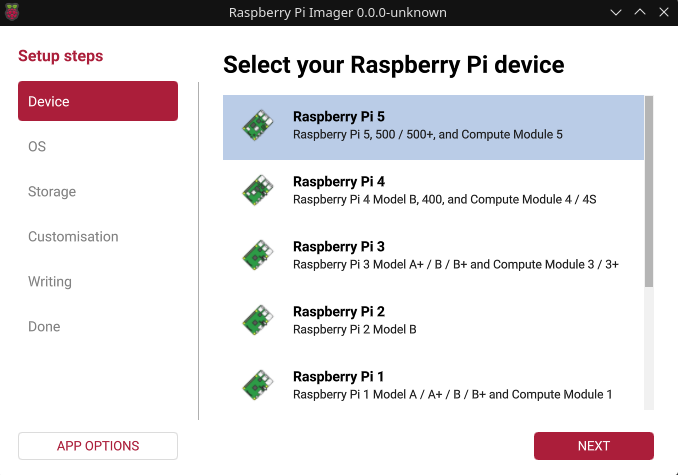

 
   
2. **OS**: Raspberry Pi OS Lite (64-bit) — headless, no desktop environment.
 
   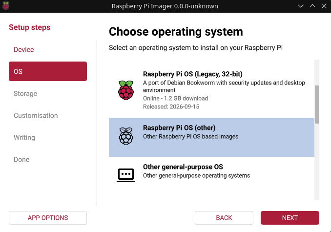
 
   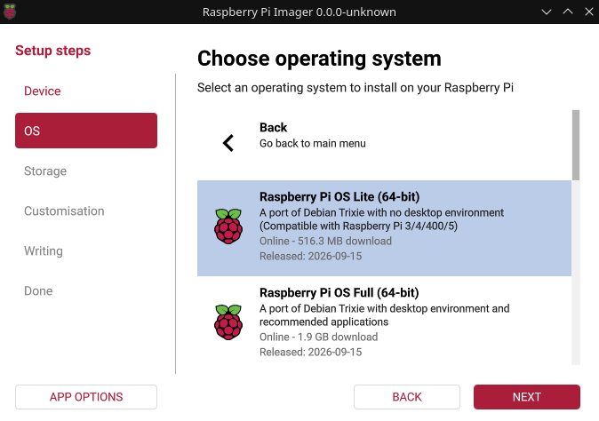
   
 

3. **Storage**: the 128GB SD card freed from the Jetson.
 
   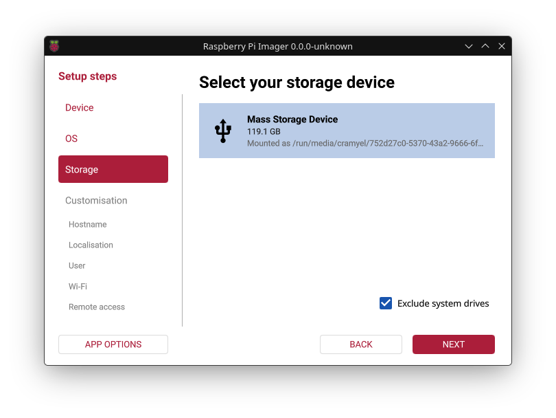

 
   
4. **Hostname**: `RVMN-RPI`
 
   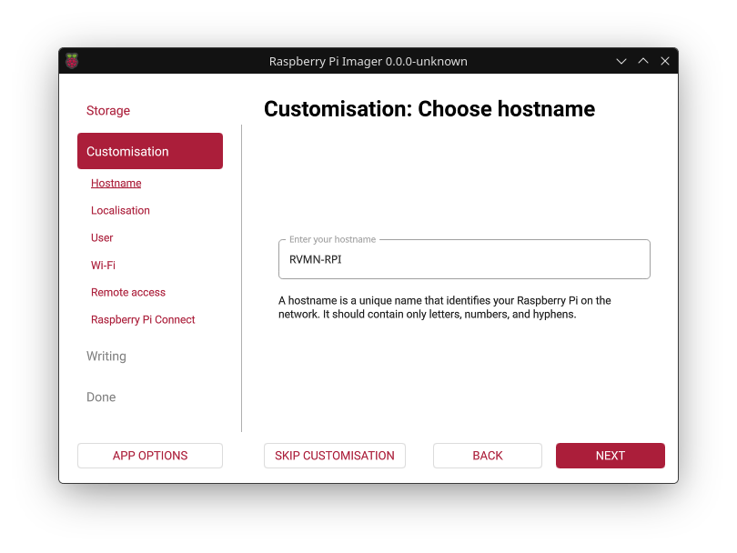

 

5. **Localisation**: Madrid (Spain) timezone, `es` keyboard layout.
 
   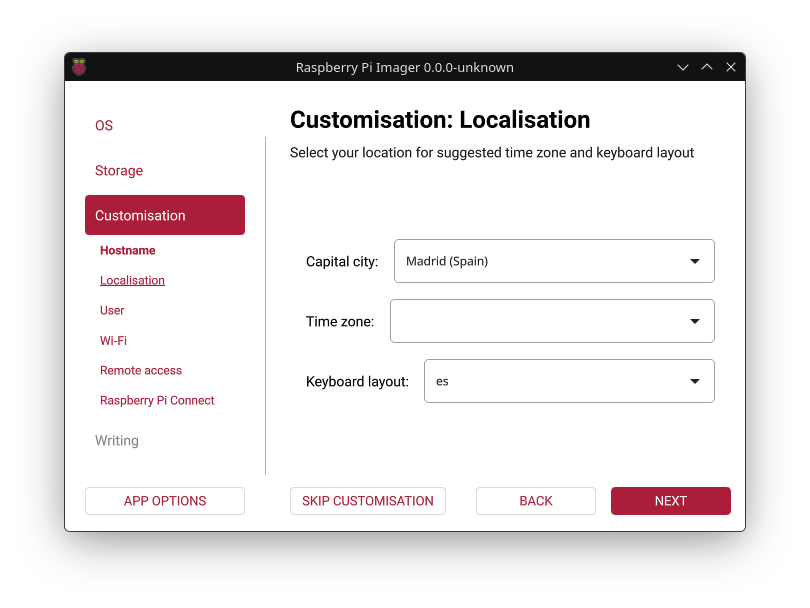

 

6. **User account** created.
 
   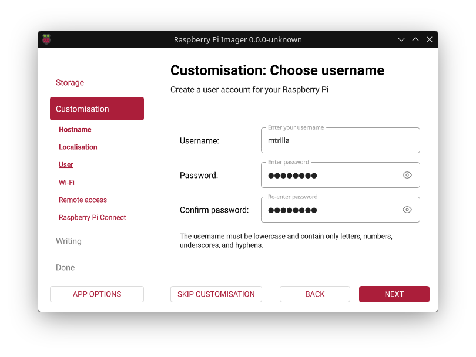

 

7. **Wi-Fi** configured as a fallback connection.
 
   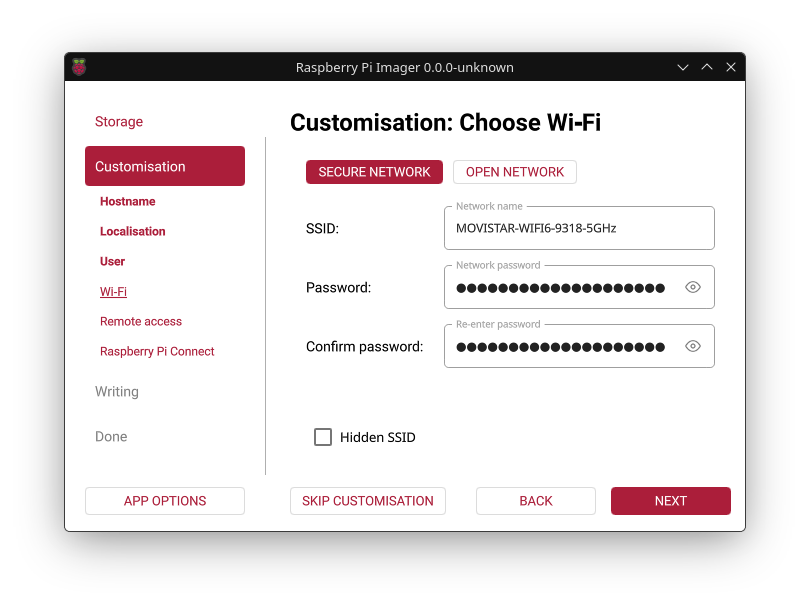

 
   
8. **SSH**: enabled, public key authentication only, password login disabled.
 
   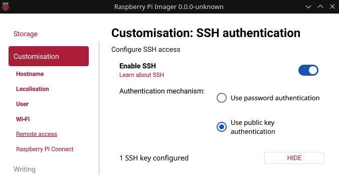

 
   
9. **Raspberry Pi Connect**: left disabled (SSH is enough for remote access).
 
   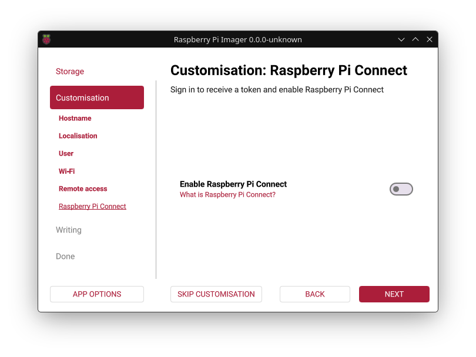

 
   
10. Reviewed the summary and wrote the image to the SD card.
 
    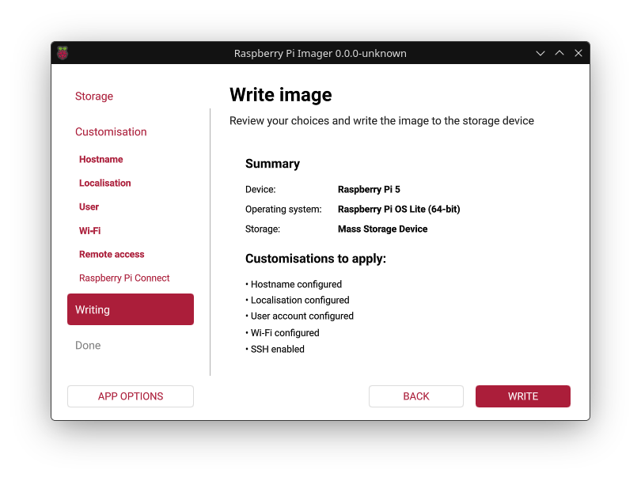

 

11. Write completed successfully.
 
    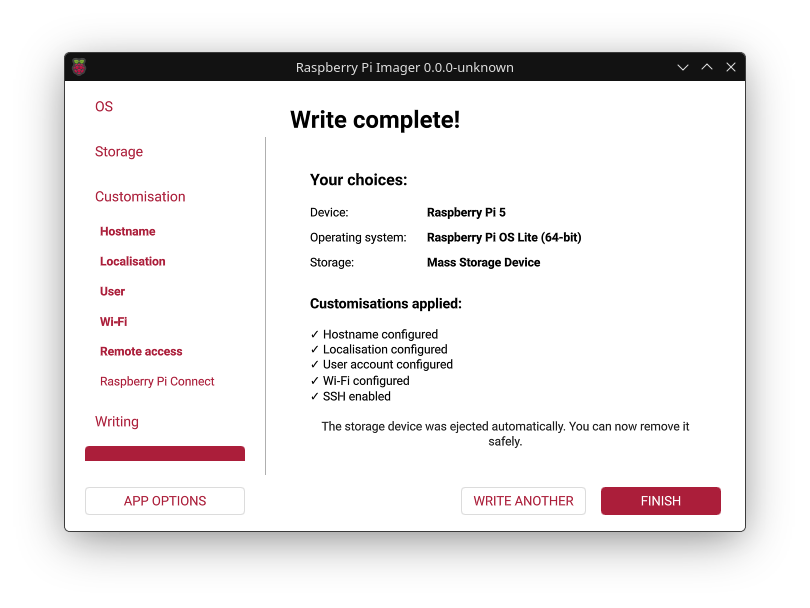

